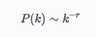
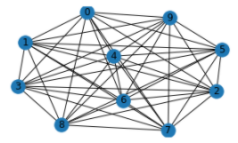
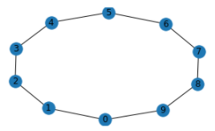
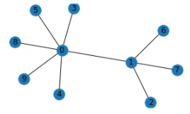

# **Simulation à environnement social centrée-individus de la COVID19**

## **Participations**

* Travail réalisé par [**Antoine Nollet**](mailto:antoine.nollet.etu@univ-lille.fr)

* Encadrant de recherche, [**Philippe Mathieu**](https://www.cristal.univ-lille.fr/profil/pmathieu)

* Responsable d'UE, [**Sylvain Salvati**](https://pro.univ-lille.fr/sylvain-salvati/)

<br /><br /><br />

<div style="display:flex;">
<figure style="text-align:center;margin-right:30px;">

<figcaption>
<a href="https://www.fil.univ-lille1.fr/portail/index.php?dipl=L&label=Pr%C3%A9sentation">FIL</a>
</figcaption>
</figure>
<figure style="text-align:center">

<figcaption>
<a href="https://www.cristal.univ-lille.fr/equipes/smac/">SMAC</a>
</figcaption>
</figure>
</div>

<br /><br />

--- 

<br />

## Plan

1. <a href="#contexte"><strong>Contexte</strong></a>
    * <a href="#crise"><strong>Crise de la Covid</strong></a>
    * <a href="#simulation"><strong>Simulation épidémiologique</strong></a>
    * <a href="#sma"><strong>Systèmes Multi-Agents</strong></a>
    * <a href="#env"><strong>Environnements</strong></a> 
    * <a href="#pbtique"><strong>Problématique</strong></a>
    
    
2. <a href="#methode"><strong>Méthodes</strong></a>
    * <a href="#graph"><strong>Graphes Sociaux</strong></a>
    * <a href="#algo"><strong>Algorithme Génétique</strong></a>
    
    
3. <a href="#experience"><strong>Expériences</strong></a>
    * <a href="#courbe"><strong>Courbes COVID</strong></a>
    * <a href="#agent"><strong>Agent Adapté</strong></a>
    * <a href="#principes"><strong>5 principes fondamentaux</strong></a>
    * <a href="#problem"><strong>Toy Problem</strong></a>
    

4. <a href="#conclusion"><strong>Conclusion</strong></a>

5. <a href="#remerciements"><strong>Remerciements</strong></a>

6. <a href="#bibli"><strong>Bibliographie</strong></a>

7. <a href="#annexe1"><strong>Annexe 1 : Tuto DEAP</strong></a>

8. <a href="#annexe2"><strong>Annexe 2 : Implémentation du Dilemme de l'Interaction</strong></a>

<br />

---

<br /><br /><br /><br /><br /><br />

<h2 id="contexte"><strong>Contexte</strong></h2>
<p style="text-align:justify">
Ce rapport a été écrit dans le cadre d'une Unité d'Enseignement de la troisième année de la Licence Informatique de l'Université de Lille. Ce cadre est une option de découverte et de sensibilation à la recherche scientifique en informatique. Ainsi ce papier refléte le travail fourni par l'étudiant. Travail encadré dans l'axe des thématiques abordés par l'équipe SMAC au sein du laboratoire Cristal, le laboratoire d'informatique de l'Université de Lille. Les recherches menées dans l’équipe sont résolument multi-disciplinaires et cherchent à concevoir des “éprouvettes virtuelles” favorisant l’étude des systèmes complexes par l’observation d’entités autonomes dotées d’une intelligence artificielle. Cette approche est qualifiée de “centrée individu” car son objectif est d’obtenir les phénomènes de groupe attendus par agrégation de comportements individuels, en d’autres termes permettre le passage d’un niveau d’observation microscopique (individus) à un ou plusieurs niveaux macroscopiques (groupes). Cette approche est particulièrement adaptée pour la réalisation de simulateurs dans des domaines aussi variés que la finance computationnelle, la simulation de foules, le trafic routier ou la biologie cellulaire. Dans ces domaines, les outils et plateformes créés par l’équipe servent aussi bien à la simulation, au Serious Game qu’à la résolution de problèmes. L’équipe travaille notamment sur l’élaboration et le codage de comportements intelligents pour les entités artificielles, l’élaboration de plateformes logicielles pour les exploiter, et l’élaboration de méthodes permettant d’aller de l’analyse d’un problème à sa réalisation concrète. L’équipe est très sensible aux aspects pratiques et concrets de cette approche. Elle propose notamment plusieurs plateformes permettant d’attaquer ces problèmes avec le plus d’efficacité possible et avec un souci constant d’éviter les biais dans les simulations.
</p>
<br />
<h3 id="crise"><strong>Crise de la Covid</strong></h3> 

<p style="text-align:justify">
Depuis Mars 2020, la crise de la pandémie de la COVID-19 a beaucoup impacté nos sociétés. <a href="#1">(1)</a></p>

<p style="text-align:justify">
Son impact est d'une envergure mondiale <a href="#2">(2)</a>, il est donc important de la modéliser ! <a href="#3">(3)</a></p>

<p style="text-align:justify">
Nous allons donc nous tourner vers les diverses approches de simulation.
</p>

<br />
<h3 id="simulation"><strong>Simulation épidémiologique</strong></h3> 

<p style="text-align:justify">
Nous distinguons diverses approches afin de simuler une épidémie. 
</p>
<p style="text-align:justify">
Premièrement, il y a l'approche mathématique (beaucoup de modèles suivent cette approche, comme le modèle SIS <a href="#4">(4)</a>), dont le but est d'obtenir des équations. 
</p>
<p style="text-align:justify">
Deuxièmement, il y a l'approche dite compartimentale (comme le modèle SEIR <a href="#5">(5)</a>, où la population est divisée dans des "compartiments" : par exemple les (S)usceptibles, les (E)xposé.e.s, les (I)nfecté.e.s et les (R)établi.e.s). L'intérêt de cette approche est de pouvoir modéliser différents états de la population (on peut créer toutes sortes de compartiments, suivant les états qu'on veut modéliser)
</p>
<p style="text-align:justify">
Enfin il y a l'approche dite centrée-individus. Le principe est de prendre en compte dans la simulation le comportement de chaque individu de la population. Ainsi, on espère approcher un modèle de simulation le plus proche possible de la réalité, où chaque individu possède son comportement propre (contrairement au modèle compartimental où les individus sont en "paquets" selon leur état et qui ont les mêmes probabilités de passer d'un état à l'autre <a href="#6">(6)</a>)
</p>
<p style="text-align:justify">
Dans le cadre de ce rapport, nous nous focalisons sur l'approche centrée-individus, et donc sur l'utilisation de Systèmes Multi-Agents.
</p>
<br />
<h3 id="sma"><strong>Systèmes Multi-Agents</strong></h3> 

<p style="text-align:justify">
Un système Multi-Agents <a href="#7">(7)</a> est un système composé de diverses entités (les Agents) ayant chacune leur comportement. Chaque agent analyse son environnement, ses semblables et les diverses informations à sa disposition pour prendre ses décisions en conséquence. Un agent peut représenter ou non des êtres vivants, sa propriété principale est d'avoir un comportement qui lui est propre. Il doit être autonome dans sa prise de décisions. Le système a un contrôle sur l'ensemble des agents (collecte de données, évènements sur un ou plusieurs agents, mise en place de "tour" de parole). 
Afin d'accueillir les agents, le système a besoin de définir un environnement où les agents se positionnent.
</p>

<br />
<h3 id="env"><strong>Environnements</strong></h3> 

<p style="text-align:justify">
Il existe plusieurs sortes d'environnements pour des systèmes Multi-Agents. Le plus connu est l'environnement géographique (par exemple le célèbre jeu Sim City (<a href="#8">(8)</a> où des agents, les citoyens, se déplacent dans une ville). Dans un environnement géographique, il y a la notion de coordonnées (réelles, comme le jeu précèdemment cité, ou discrètes, comme dans le Jeu de la Vie <a href="#9">(9)</a> ).
Néanmoins, il y a les environnements sociaux, représentés par un graphe (comme pour le Haslemere Network <a href="#10">(10)</a>) . Les noeuds sont des agents et les arêtes sont les interactions entre agents. 
Dans la suite de ce travail, il m'a été demandé travailler sur un environnement social.
</p>

<br /><br /><br /><br /><br />
<h3 id="pbtique"><strong>Problématique</strong></h3>

<p style="text-align:justify">

La question de recherche qui m'a été posée pour ce stage consiste à définir si une simulation centrée-individus à environnement social de la COVID19 est envisageable ou non. Il a été demandé d'utiliser le langage de programmation Python, qui permet facilement l'utilisation de diverses librairies. Un système composé de nombreux Agents peut très vite avoir une complexité en temps importante et donc les expériences menées ont été faites avec un nombre raisonable d'agents.

</p>

<p style="text-align:justify">
Pour réaliser ce travail, nous avons besoins de plusieurs outils :  
* les Systèmes Multi-Agents : Présentés ci-dessus, ils permettent le fonctionnement de la simulation. (démarrage, analyse)
* les Réseaux Sociaux : Un système multi-agents a besoin d'un environnement. Il a été demandé d'utiliser un environnement social. Les noeuds sont les agents et les arêtes sont les interactions entre agents. Cependant, nous nous plaçons donc dans un réseau dont la structure est encore à définir.
* les Algorithmes Génétiques : La simulation a pour objectif d'être cohérente avec la réalité. Nous utilisons les algorithmes génétiques pour y parvenir. 
</p>

---

<br />

<h2 id="methode"><strong>Méthodes</strong></h2>

<br />

<h3 id="graph"><strong>Graphes Sociaux</strong></h3>

<p style="text-align:justify">
Pour structurer notre environnement social, différents choix sont possibles. Nous pourrions choisir un graphe structuré, comme un graphe complet <a href="#11">(11)</a> ou comme un graphe cycle <a href="#12">(12)</a>.
Cependant nous allons plutôt nous tourner vers un graphe à structure aléatoire, pour simuler les interactions humaines. Ce choix nous semble plus adapté face à la nature imprévisible de ces relations. Néanmoins plusieurs choix de graphe à structure aléatoire existent, comme par exemple le graphe Erdos-Renyi <a href="#13">(13)</a> où chaque couple de noeuds a la même probabilité d'être relié. Pour palier à ce défaut, il existe le concept de graphe invariant d'échelle <a href="#14">(14)</a>, où les degrés des noeuds du graphe suivent une loi de puissance. Plus précisement, il s'agit d'un graphe dont la proportion de nœuds de degré k, noté P(k) suit la loi :
</p>



avec r étant l'exposant d'invariance d'échelle (strictement positif)

<p style="text-align:justify">
De nombreux réseaux sont conjecturés invariants d'échelle, comme les réseaux sociaux <a href="#15">(15)</a> ou le célèbre World Wide Web <a href="#16">(16)</a> : c'est la raison pour laquelle on va choisir d'utiliser un graphe invariant d'échelle comme environnement de notre Système Multi-Agents. Il existe différentes manières de construire un graphe invariant d'échelle, nous choisissons d'utiliser le modèle Barabasi-Albert. <a href="#17">(17)</a>
</p>

Pour le tracé des graphes, nous utilisons la librairie NetworkX <a href="#18">(18)</a> de python.

<br />

<div style="display:flex;">
<figure style="text-align:center;margin-right:30px;">

<figcaption>
<a href="https://fr.wikipedia.org/wiki/Graphe_complet">Complet</a>
</figcaption>
</figure>
<figure style="text-align:center">

<figcaption>
<a href="https://fr.wikipedia.org/wiki/Graphe_cycle">Cycle</a>
</figcaption>
</figure>
</div>
<div style="display:flex;">
<figure style="text-align:center">

<figcaption>
<a href="https://users.renyi.hu/~p_erdos/1960-10.pdf">Erdos-Renyi</a>
</figcaption>
</figure>
<figure style="text-align:center">

<figcaption>
<a href="https://barabasi.com/f/67.pdf">Barabasi-Albert</a>
</figcaption>
</figure>
</div>

<br /><br /><br /><br /><br />

<h3 id="algo"><strong>Algorithme Génétique</strong></h3>

<p style="text-align:justify">
Notre système établi avec son environnement, nous voulons qu'il simule la réalité de la crise de la COVID-19. Ainsi, il nous faut trouver un paramétrage optimal qui permette au système d'obtenir les données réelles (nombres de réanimations, de morts...) de cette crise. Parmi les différentes méthodes d'optimisation, nous choisissons d'utiliser la technique des algorithmes génétiques. <a href="#19">(19)</a> L'algorithme génétique est un algorithme évolutionniste <a href="#20">(20)</a> qui va faire tendre une population de données vers un objectif donné (on parlera ici de la mesure d'adaptabilité au milieu, la "fitness"). On cherche les individus de la population qui ont la meilleure fitness. L'algorithme génétique s'appuie sur 3 méthodes principales : le crossing-over (croisement entre individus), la mutation (changement d'attribut d'un individu) et de sélection (comparaison des individus selon la fitness établie et sélection des meilleurs individus) dans le but de retourner une population optimisée.
</p>
<p style="text-align:justify">
Nous utilisons la librairie DEAP <a href="#21">(21)</a> de python pour implémenter les différents algorithmes génétiques au cours de ces recherches. Vous pouvez ainsi retrouver en annexe un <a href="#annexe1">tuto deap</a> que j'ai écrit dans le cours de mes travaux.
</p>

<br />

---

<br /><br />
<h2 id="experience"><strong>Expériences</strong></h2>

<br />

<h3 id="courbe"><strong>Courbes COVID</strong></h3>

<p style="text-align:justify">
Pour que la simulation soit cohérente avec la réalité, il faut récupérer les données réelles sur la COVID-19. Ces données sont récupérées au format CSV depuis le site des données du gouvernement français. <a href="#22">(22)</a>
</p>
 
La courbe tracée ci-dessous a été réalisée grâce à la libraire Pyplot <a href="#23">(23)</a> de Python.

<figure style="text-align:center;margin-right:30px;">

<figcaption>
<a href="https://www.data.gouv.fr/fr/datasets/chiffres-cles-concernant-lepidemie-de-covid19-en-france/">data.gouv.fr</a>
</figcaption>
</figure>

<p style="text-align:justify">
Il faut noter ici que l'on s'arrête volontairement avant Septembre 2020 par soucis de ne traiter qu'une seule sorte de COVID-19, car après cette date, de nombreux variants de la maladie se sont déclarés. 
</p>

<br />

<h3 id="agent"><strong>Agent Adapté</strong></h3>

<p style="text-align:justify">
Pour une simulation adaptée à la COVID-19, il faut configurer en conséquence les agents du système dans lequel se déroule notre simulation. Ainsi, ils ont comme caractéristiques leur groupe saguin <a href="#24">(24)</a>, leur sexe et leur âge <a href="#25">(25)</a>. Nous nous contentons de ces caractéristiques pour éviter des problèmes d'overfitting. <a href="#26">(26)</a> Les données de recencement sur les sexes et âges de la population française seront récupérées sur le site de l'INSEE <a href="#27">(27)</a>, et celles sur les groupes sanguins seront récupérées sur le Figaro. <a href="#28">(28)</a>
</p>

<br /><br /><br /><br /><br /><br /><br />

<h3 id="principes"><strong>5 principes fondamentaux</strong></h3>

<p style="text-align:justify">
Nous avons donc les éléments nécessaires dans la mise en oeuvre d'une simulation à environnement social centrée-individus de la COVID19. Premièrement, nous avons configurés nos agents. Deuxièmement, nous nous situons dans un graphe invariant d'échelle comme environnement de la simulation. Ensuite, nous utilisons les agents et l'environnement au sein d'un système Multi-Agents. Ensuite, nous utilisons les données réelles de la maladie, récupérées depuis le site des données du gouvernement français, comme objectif à atteindre avec notre simulation. Enfin, nous utilisons un algorithme génétique pour faire tendre notre simulation vers des résultats conformes à la réalité.
</p>

<br />

<h3 id="problem"><strong>Toy Problem</strong></h3>

Nous illustrons ces principes avec un problème simple.

Posons le cadre du problème du "dilemme de l'interaction" : 

<p style="text-align:justify">
Il s'agit d'une population d'individus possédant 3 caractéristiques et une approche. Chaque individu possède un voisinage. Le principe du problème est qu'à chaque tour, certains individus ne seront plus actifs et d'autres le resteront. Pour qu'un individu reste actif, il faut qu'il reçoive de l'attention d'un autre individu. Pour qu'un individu donne son attention à un autre individu, cela dépend de son approche : si il est subjectif, il donne son attention aux individus qui ont les mêmes caractéristiques que lui, sinon, il donne son attention aux individus qui n'ont pas les mêmes caractéristiques que lui.
</p>

Modélisons donc ce problème avec les méthodes vues précédemment :

<p style="text-align:justify">
Premièrement, les agents ont 4 attributs qui sont des booléens : les 3 premiers sont les caractéristiques de l'agent, le dernier correspond à son approche (<em>True</em> si subjectif, <em>False</em> sinon). Deuxièmement, nous utilisons donc un graphe Barabasi-Albert avec un exposant d'invariance d'échelle à 3 comme environnement de la simulation. Ensuite, nous créons notre système Multi-Agents qui prendra 4 paramètres : 3 probabilités correspondant chacune à la probabilité qu'une caractéristique soit à <em>True</em> pour chacuns des agents du système, et 1 probabilité correspondant au fait qu'un agent ait une approche subjectif. Ensuite, nous posons comme objectif une maximisation du nombre d'agents actifs à la fin de la simulation. Enfin, nous utilisons un algorithme génétique (de la librairie DEAP de python) afin d'obtenir les paramètres optimaux à donner au système Multi-Agents pour qu'à la fin de la simulation il y ait le plus d'agents actifs que possible.
</p>

<br /><br />

<p>Voici un extrait de l'implémentation des Agents :</p>

```python

class Agent:
    
    def __init__(self, id_number, sma, accointances, stats): 
        # configuration, voir annexe 2
        self.prop1 = stats["prop1"] # caractéristique 1
        self.prop2 = stats["prop2"] # caractéristique 2
        self.prop3 = stats["prop3"] # caractéristique 3
        self.subjectif = stats["subjectif"] # approche
        self.interet = False
        self.Dead = False

    def decide(self, tick):
        if not(self.Dead):
            voisins = self.getVoisins()
            if self.subjectif:
                [self.giveInteretTo(voisin) for voisin in voisins if self == voisin]
            else:
                [self.giveInteretTo(voisin) for voisin in voisins if self != voisin]
     
    def __eq__(self, o):
        return isinstance(o,Agent) and self.prop1 == o.prop1 and self.prop2 == o.prop2 and self.prop3 == self.prop3

```

<p style="text-align:justify">
Ici, les attribut <em>prop</em> d'un agent sont des booléens mais pourraient être de n'importe quel autre type ! Aussi, on constate à l'agent les attributs *subjectif* (l'approche de l'agent), <em>interet</em> (l'agent a reçu de l'attention ?) et <em>Dead</em> (l'agent n'est plus actif ?). Lorsqu'un agent est amené à décider, il agit seulement si il est toujours actif. Si il l'est en effet, il va donner de l'attention à certains autres agents de son voisinage selon son approche. S'il est par exemple subjectif, alors il donnera de l'attention aux agents qui ont les mêmes <em>prop</em> que lui. Sinon, il en donnera aux agents qui n'ont pas les mêmes <em>prop</em> que lui.
</p>

<br /><br /><br />

<p>Voici un extrait de l'implémentation d'un Système Multi-Agents :</p>
<br />

```python

class SMA:
    
    def createSMA_nbagents(nb_agents,nb_contact,pb1,pb2,pb3,pbS):
        graph = nx.barabasi_albert_graph(nb_agents, nb_contact)
        return SMA.createSMA_graph(graph,pb1,pb2,pb3,pbS)

    def createSMA_graph(graph,pb1,pb2,pb3,pbS):
        matrix = nx.to_numpy_array(graph, nodelist=range(graph.number_of_nodes()))
        return SMA(graph.number_of_nodes(),graph, matrix, pb1,pb2,pb3,pbS)
    
    def __init__(self, nb_agents,graph,adjacency_matrix,pb1,pb2,pb3,pbS):
        # cofiguration voir annexe 2
        self.agentList = []
        self.graph = graph
        self.pbs = [pb1,pb2,pb3,pbS]
        for i in range(nb_agents):
            self.agentList.append(self.createAgent(i,adjacency_matrix))
            
    def createAgent(self,i,adjacency_matrix):
        stats = dict()
        r = random.random()
        statNames = [("prop1",self.pbs[0]),("prop2",self.pbs[1]),
                     ("prop3",self.pbs[2]),("subjectif",self.pbs[3])]
        for stat in statNames:
            stats[stat[0]] = (r < stat[1])
        return Agent(i, self, np.nonzero(adjacency_matrix[i])[0],stats)
    
    def run(self, rounds):
        #configuration voir annexe 2
        oldNbLives = -1
        newNbLives = self.nbLives()
        while self.tick < rounds and oldNbLives != newNbLives and not(self.allDead()):
            oldNbLives = newNbLives
            self.runOnce()
            newNbLives = self.nbLives()
        return self.nbLives()
            
    def runOnce(self):
        #configuration voir annexe 2
        for agent in self.agentList:
            agent.decide(self.tick)
        self.setDeath()

```

<br />

<p style="text-align:justify">
Ici, nous utilisons la fonction <em>createSMA_nbagents</em> pour initialiser notre système avec un environnement social structuré avec un graphe Barabasi-Albert. On constate que le système prend en paramètre 4 probabilités (<em>pb1</em>, <em>pb2</em>, <em>pb3</em> et <em>pbS</em>) qui lui serviront à créer les agents du système. Lorsque nous démarrons le système, le système ne s'arrêtera que lorsqu'une de ces 3 conditions deviendra vraie :
</p>

* Le nombre de tour de simulation prévu est dépassé
* Le nombre d'agents actifs d'un tour à l'autre n'a pas changé : si cela est le cas alors c'est que chaque agent reçoit de l'attention et il n'y a pas de raison que ça ne soit plus le cas.
* Tous les agents ont arrêté d'être actifs

<p style="text-align:justify">
Lors de chaque tour de simulation, le système donnera la parole à chaque agent qui décidera à qui il donne de l'attention. À la fin d'un tour de simulation, le système rend inactif les agents n'ayant pas reçu d'attention.
</p>

<br /><br /><br /><br /><br />
<p>Voici un extrait de l'implémentation de l'algorithme génétique :</p>


```python

def evaluate_SMA(N,nb_contact,ind):
    res = []
    for i in range(100):
        sma = SMA.createSMA_nbagents(N,nb_contact,ind[0],ind[1],ind[2],ind[3])
        res += [sma.run(100)]
    return (np.mean(res),)
    

def algo_gen_SMA(nb_ind_pop,nb_gen,nb_contact):
    creator.create("FitnessMax", base.Fitness, weights=(1.0,))
    creator.create("Individual", list, fitness=creator.FitnessMax)
    
    toolbox=base.Toolbox()
    toolbox.register("att",random.random)
    toolbox.register("individual", tools.initRepeat, creator.Individual, toolbox.att, 4)
    toolbox.register("population", tools.initRepeat, list, toolbox.individual)
    toolbox.register("evaluate",evaluate_SMA,nb_ind_pop,nb_contact)
    toolbox.register("mutate",tools.mutShuffleIndexes,indpb=0.2)
    toolbox.register("mate",tools.cxOnePoint)
    toolbox.register("select",tools.selBest)
    
    hof = tools.HallOfFame(1)

    stats = tools.Statistics(lambda ind : ind.fitness.values)
    stats.register("avg",np.mean)
    stats.register("std",np.std)
    stats.register("min",np.min)
    stats.register("max",np.max)
    
    p = toolbox.population(n=nb_ind_pop)
    
    pop, log = algorithms.eaSimple(p, toolbox,cxpb=0.5, mutpb=0.2 , ngen=nb_gen , stats=stats, halloffame=hof, verbose=False)
    
    return {"pop":pop,"log":log,"hof":hof,"stats": stats}

```
<p style="text-align:justify">
Ici la fonction d'évaluation <em>evaluate_SMA</em> sert à déterminer la <em>fitness</em> d'un individu. Les individus, dans cet exemple, sont des listes de 4 probabilités (allant de 0 à 1). Pour déterminer la <em>fitness</em> d'un individu, on utilise l'individu en paramètre d'un nombre important de systèmes multi-agents (les mêmes que décrits ci-dessus) pour en obtenir l'espérance du nombre d'agents actifs à la fin d'une simulation si on utilisait les probabilités de l'individu.
</p>
<p style="text-align:justify">
Pour comprendre intégralement la fonction <em>algo_gen_SMA</em>, il vous faut être familier avec la librairie DEAP de python. ( vous pouvez consulter <a href="#annexe1">l'annexe 1</a> pour cela)
</p>
<p style="text-align:justify">
Cet algorithme génétique se place dans un objectif de maximisation, que l'évaluation des fitness des individus soient la plus grande que possible (on veut que les agents restent actifs !). On utilise une mutation qui mélange les probabilités d'un individu, un croisement à un point qui crée un individu en regroupant les moitiés de deux individus, et une sélection des individus avec la meilleure fitness.
</p>
On a pu obtenir, à la fin de l'algorithme génétique, les individus suivant : 

```
[0.9885790440181539, 0.9863487964155002, 0.11439252878648731, 0.9289995660879429]
[0.9421081837563204, 0.08395343157452273, 0.9395278585769126, 0.9771571517341212]
[0.014014248535267337, 0.999929560455892, 0.9702449823412255, 0.9326979768187923]
[0.9752475982427464, 0.9601164411677091, 0.9636533632286904, 0.9015081500093076]
[0.41621536907077994, 0.5149339882652899, 0.5785749838237019, 0.00132349420690128]
```
<p style="text-align:justify">
En effet, avec les trois premières probabilités proches de 0 ou 1, les agents auront donc tous de fortes chances d'avoir les mêmes <em>prop</em>. Si les agents ont les mêmes <em>prop</em>, ils ont intérêts d'avoir une approche subjective pour rester actifs (dernière probabilité proche de 1). En opposition, si les trois premières probabilités sont proches de 0.5, les agents auront de fortes chances d'être tous différents. Si les agents sont différents, ils ont intérêts d'avoir une approche objective pour rester actifs (dernière probabilité proche de 0). Ainsi, les résultats obtenus sont conformes au problème posé.
</p>
<br />

---

<br /><br /><br /><br /><br /><br /><br /><br /><br />

<h2 id="conclusion"><strong>Conclusion</strong></h2>
<p style="text-align:justify">
En conclusion, on constate qu'une simulation à environnement social centrée-individus de la COVID19 est en effet possible. Avec les méthodes étudiés et les données réelles accessibles sur le COVID19, il ne manquerait plus que du temps afin d'établir une telle simulation qui serait pertinente dans la réalité de cette pandémie et de ses conséquences sur les individus.
</p>
<p style="text-align:justify">
Nous pouvons également conclure sur les apports que ces travaux ont eu sur moi. Tout d'abord, il faut noter qu'au début de cette approche de la recherche, je ne m'y connaissais pas en simulation épidémiologique, en systèmes multi-agents, en réseaux invariants d'échelle et en algorithme génétique. J'ai eu de nombreuses occasions de m'informer de manière approfondie sur les actualités de la pandémie de la COVID-19, de part la nature concrète de mes travaux. De plus, monsieur Mathieu m'a formé à une certaine rigueur et exigence tout au long de ces travaux. Cette option d'initiation à la recherche a été pour moi l'occasion de me former à de nouveaux concepts informatiques, de nouvelles méthodes de travail et au monde de la recherche. Connaissances et Méthodes qui me seront utiles pour mon avenir professionnel et pour ma culture générale.
</p>

<br />

---

<br /><br /><br /><br /><br />

<h2 id="remerciements"><strong>Remerciements</strong></h2>
<p style="text-align:justify">
Tout le travail fourni dans le cadre de cette option de Recherche scientifique en Informatique a été très enrichissant et valorisant. Je tiens à remercier Sylvain Salvati d'avoir rendu cette Unité d'Enseignement accessible aux étudiants en troisième année de Licence Informatique à l'Université de Lille. Je tiens à remercier, tout particulièrement, Philippe Mathieu, pour m'avoir encadré et conseillé dans mes travaux et aussi pour m'avoir enseigné des notions qui m'étaient jusqu'ici inconnues et que je trouve passionnantes.
</p>

<br />

---

<br /><br /><br /><br /><br /><br /><br /><br /><br /><br /><br /><br /><br /><br /><br /><br /><br /><br /><br /><br /><br /><br /><br /><br /><br /><br /><br /><br /><br /><br /><br />

<h2 id="bibli"><strong>Bibliographie</strong></h2>

<br /><br />

<p id="1"> (1) <a href ="https://fr.wikipedia.org/wiki/Crise_%C3%A9conomique_li%C3%A9e_%C3%A0_la_pand%C3%A9mie_de_Covid-19"> https://fr.wikipedia.org/wiki/Crise_%C3%A9conomique_li%C3%A9e_%C3%A0_la_pand%C3%A9mie_de_Covid-19 </a></p>
<p id="2"> (2) <a href ="https://fr.wikipedia.org/wiki/Pand%C3%A9mie_de_Covid-19_en_France"> https://fr.wikipedia.org/wiki/Pand%C3%A9mie_de_Covid-19_en_France </a></p>
<p id="3"> (3) <a href ="https://www.nature.com/articles/d41586-020-01003-6"> https://www.nature.com/articles/d41586-020-01003-6 </a></p>
<p id="4"> (4) <a href ="https://hal.archives-ouvertes.fr/hal-01414037v2/document"> https://hal.archives-ouvertes.fr/hal-01414037v2/document </a></p>
<p id="5"> (5) <a href ="https://fr.wikipedia.org/wiki/Mod%C3%A8les_compartimentaux_en_%C3%A9pid%C3%A9miologie"> https://fr.wikipedia.org/wiki/Mod%C3%A8les_compartimentaux_en_%C3%A9pid%C3%A9miologie </a></p>
<p id="6"> (6) <a href ="https://pubsonline.informs.org/doi/pdf/10.1287/mnsc.1070.0787"> https://pubsonline.informs.org/doi/pdf/10.1287/mnsc.1070.0787 </a></p>
<p id="7"> (7) <a href ="https://ceng621.cankaya.edu.tr/uploads/files/Anintroductiontomultiagentsystems%20(1).pdf"> https://ceng621.cankaya.edu.tr/uploads/files/Anintroductiontomultiagentsystems%20(1).pdf </a></p>
<p id="8"> (8) <a href ="https://fr.wikipedia.org/wiki/SimCity_(jeu_vid%C3%A9o,_1989)"> https://fr.wikipedia.org/wiki/SimCity_(jeu_vid%C3%A9o,_1989) </a></p>
<p id="9"> (9) <a href ="https://fr.wikipedia.org/wiki/Jeu_de_la_vie"> https://fr.wikipedia.org/wiki/Jeu_de_la_vie </a></p>
<p id="10"> (10) <a href ="https://www.nature.com/articles/s41591-020-1036-8.pdf"> https://www.nature.com/articles/s41591-020-1036-8.pdf </a></p>
<p id="11"> (11) <a href ="https://fr.wikipedia.org/wiki/Graphe_complet"> https://fr.wikipedia.org/wiki/Graphe_complet </a></p>
<p id="12"> (12) <a href ="https://fr.wikipedia.org/wiki/Graphe_cycle"> https://fr.wikipedia.org/wiki/Graphe_cycle </a></p>
<p id="13"> (13) <a href ="https://users.renyi.hu/~p_erdos/1960-10.pdf"> https://users.renyi.hu/~p_erdos/1960-10.pdf </a></p>
<p id="14"> (14) <a href ="https://fr.wikipedia.org/wiki/R%C3%A9seau_invariant_d%27%C3%A9chelle"> https://fr.wikipedia.org/wiki/R%C3%A9seau_invariant_d%27%C3%A9chelle </a></p>
<p id="15"> (15) <a href ="https://fr.wikipedia.org/wiki/R%C3%A9seau_social"> https://fr.wikipedia.org/wiki/R%C3%A9seau_social </a></p>
<p id="16"> (16) <a href ="https://fr.wikipedia.org/wiki/World_Wide_Web"> https://fr.wikipedia.org/wiki/World_Wide_Web </a></p>
<p id="17"> (17) <a href ="https://barabasi.com/f/67.pdf"> https://barabasi.com/f/67.pdf </a></p>
<p id="18"> (18) <a href ="https://networkx.org/documentation/stable/tutorial.html"> https://networkx.org/documentation/stable/tutorial.html </a></p>
<p id="19"> (19) <a href ="https://books.google.fr/books?hl=fr&lr=&id=0eznlz0TF-IC&oi=fnd&pg=PP9&dq=genetic+algorithm&ots=sijI101bJk&sig=G9-ZzgInicuOjfMTIVzEP6bObI8#v=onepage&q&f=false"> https://books.google.fr/books?hl=fr&lr=&id=0eznlz0TF-IC&oi=fnd&pg=PP9&dq=genetic+algorithm&ots=sijI101bJk&sig=G9-ZzgInicuOjfMTIVzEP6bObI8#v=onepage&q&f=false </a></p>
<p id="20"> (20) <a href ="https://fr.wikipedia.org/wiki/Algorithme_%C3%A9volutionniste"> https://fr.wikipedia.org/wiki/Algorithme_%C3%A9volutionniste </a></p>
<p id="21"> (21) <a href ="https://deap.readthedocs.io/en/master/"> https://deap.readthedocs.io/en/master/ </a></p>
<p id="22"> (22) <a href ="https://www.data.gouv.fr/fr/datasets/chiffres-cles-concernant-lepidemie-de-covid19-en-france/"> https://www.data.gouv.fr/fr/datasets/chiffres-cles-concernant-lepidemie-de-covid19-en-france/ </a></p>
<p id="23"> (23) <a href ="https://matplotlib.org/stable/tutorials/introductory/pyplot.html"> https://matplotlib.org/stable/tutorials/introductory/pyplot.html </a></p>
<p id="24"> (24) <a href ="https://www.lemonde.fr/les-decodeurs/article/2020/04/07/coronavirus-certains-groupes-sanguins-protegent-ils-contre-le-sars-cov-2_6035847_4355770.html"> https://www.lemonde.fr/les-decodeurs/article/2020/04/07/coronavirus-certains-groupes-sanguins-protegent-ils-contre-le-sars-cov-2_6035847_4355770.html </a></p>
<p id="25"> (25) <a href ="https://www.pourlascience.fr/sr/covid-19/de-nouvelles-donnees-precisent-le-risque-de-mortalite-liee-au-covid-19-en-fonction-de-l-age-et-du-sexe-20027.php"> https://www.pourlascience.fr/sr/covid-19/de-nouvelles-donnees-precisent-le-risque-de-mortalite-liee-au-covid-19-en-fonction-de-l-age-et-du-sexe-20027.php </a></p>
<p id="26"> (26) <a href ="https://fr.wikipedia.org/wiki/Surapprentissage"> https://fr.wikipedia.org/wiki/Surapprentissage </a></p>
<p id="27"> (27) <a href ="https://www.insee.fr/fr/statistiques/2381474"> https://www.insee.fr/fr/statistiques/2381474 </a></p>
<p id="28"> (28) <a href ="https://sante.lefigaro.fr/sante/analyse/groupes-sanguins/quelle-est-proportion-differents-groupes-sanguins-dans-population-francaise"> https://sante.lefigaro.fr/sante/analyse/groupes-sanguins/quelle-est-proportion-differents-groupes-sanguins-dans-population-francaise </a></p>

<br /><br /><br /><br /><br /><br /><br /><br /><br />

---

<h2 id="annexe1"><strong>Annexe 1 : Tuto DEAP</strong></h2>

---

Dans le cadre de mes recherches dans la simulation d'épidémie par Système Multi-Agents, j'ai dû appréhender le principe d'algorithme génétique.
Après avoir acquis ses principes, j'ai découvert la librairie python dénommée **Deap**.
Ce tuto a pour but de mettre au clair les possibilités que nous offre cette librairie.

---

### Plan du tuto

1. <a href="#contenu"><strong>Contenu</strong></a>
    * <a href="#creator"><strong>Creator</strong></a>
    * <a href="#base"><strong>Base</strong></a>
    * <a href="#tools"><strong>Tools</strong></a>
    * <a href="#algorithms"><strong>Algorithms</strong></a>
 
 
2. <a href="#pratique"><strong>Pratique</strong></a>
    * <a href="#pm"><strong>Les questions PM</strong></a>
    * <a href="#outils"><strong>Maîtrise base boite à outils</strong></a>
    * <a href="#polynome"><strong>Optimisation Polynome</strong></a>
    * <a href="#voyage"><strong>Voyageur de Commerce</strong></a>
    
---

<h3 id="contenu"><strong>Contenu</strong></h3>

Dans cette section **Contenu**, nous allons voir ce que nous allons nous focaliser sur la composition de la librairie.

---

<h4 id="creator"><strong>Creator</strong></h4>

Nous allons donc commencer par le module `creator` avec lequel nous allons pouvoir facilement concevoir n'importe quelle classe que nous allons pouvoir ensuite réutiliser pour nos algorithmes génétiques.


```python
from deap import creator
```

Méthode importante : `create`

    deap.creator.create(name, base[, attribute[, ...]])
    
Cette fonction sert à créer une nouvelle classe.

**Voici à quoi correspond chacun de ses paramètres** :
* **name** : Le nom de la classe qu'on veut créer
* **base** : La classe créée héritera de cette classe base
* **attribute** : chacun des prochains arguments deviendront attributs de la classe créée
    * si l'attribut est une classe, son construteur sera appelé et l'instance créée sera mise en attribut de la classe
    * sinon l'attribut est défini, il sera une constante de classe de la classe créée
    
Voici un exemple :

    create("Exemple", list, repertoire=dict, numero=1)
    
Correspond à créer la classe suivante :

    class Exemple(list):
        numero = 1

        def __init__(self):
            self.repertoire = dict()
            
On pourra donc par la suite faire appel à notre classe en tant que `creator.Exemple`.

---
<h4 id="base"><strong>Base</strong></h4>

Nous allons maintenant nous concentrer sur le module `base`. Il sera notamment utile pour accèder aux classes `deap.base.Fitness` et `deap.base.Toolbox`.


```python
from deap.base import Fitness
```

La fonction `create`, précédemment vue, nous servira donc à créer notre Objectif, notre **Fitness**.

    deap.creator.create("FitnessMin", base.Fitness, weights=(-1.0,))
    
Ici, nous avons créé une classe `FitnessMin` qui hérite donc de la classe `Fitness` du module `deap.base`.

Le paramètre ajouté, le tuple `weights`, correspond à la direction de l'objectif de notre Fitness (il est nécessaire).

Dans l'exemple ci-dessus, nous avons un Fitness avec un objectif de minimisation (de part le poids négatif).

Voici donc les manières respectives de créer des Fitness avec objectif de maximisation et des Fitness avec objectif de minimisation **et** de maximisation (en effet, l'attribut `weights` permet de gérer des Fitness multi-objectif comme les Fitness mono-objectif)

    # La maximisation
    deap.creator.create("FitnessMax", base.Fitness, weights=(1.0,))
    
    # La minimisation et la maximisation
    deap.creator.create("FitnessMulti", base.Fitness, weights=(-1.0,1.0))


```python
from deap.base import Toolbox
```

La classe `Toolbox` sera très utilisé notamment pour sa méthode `register`.

    register(alias, method[, argument[, ...]])

Cette méthode servira à affecter une certaine fonction avec un certain alias.

**Voici à quoi correspond chacun de ses paramètres** :

* **alias** : le nom par lequel nous appelerons la fonction
* **method** : la fonction qu'on veut affecter à l'alias
* **argument** : les derniers paramètres seront mis en paramètre de la fonction

Exemple d'utilisation :

    >>> def f_exemple(a, b, parametreConnu=42):
    ...     print a, b, parametreConnu
    ...
    >>> tools = Toolbox()
    >>> tools.register("monExemple", f_exemple, 13, parametreConnu=66)
    >>> tools.monExemple(42)
    13 42 66
    
Il est bien évidemment possible de déaffecter une fonction de son alias par la méthode suivante :

    unregister(alias)

Il est de même possible d'affecter un décorateur (NAB : un décorateur peut être constitué de plusieurs décorateurs) à un alias :

    decorate(alias, decorator[, decorator[, ...]])
    
Enfin, on peut simplement cloner la `Toolbox` grâce à sa méthode `clone()`. Celle-ci aura le même comportement que la fonction `copy.deepcopy()`.


---
<h4 id="tools"><strong>Tools</strong></h4>

Ensuite, c'est avec le module `tools` que nous allons pouvoir accéder aux différentes fonctions qui vont nous intéresser pour implémenter nos algorithmes génétiques. Ce module porte en effet bien son nom, car les fonctions de ce module pourront être conserver dans une instance de la classe `Toolbox`.


```python
from deap import tools
```

Il y a en effet une multitude d'outils qu'il est possible de réutiliser.

Bien qu'ils soient nombreux, il est quand même possible de les grouper vis à vis de leur utilité.

|Initialisation  |Coupe (Crossover)         |Mutation              |Sélection      | Migration          |Bloat control |
|:--------------:|:------------------------:|:--------------------:|:-------------:|:---------------:| :----:|
|initRepeat()    |cxOnePoint()              |mutGaussian()         |selTournament()                 |migRing()|staticLimit()|
|initIterate()   |cxTwoPoint()              |mutShuffleIndexes()   |selRoulette()                   ||selDoubleTournament() |
|initCycle()     |cxUniform()               |mutFlipBit()          |selNSGA2()                      |           ||
|genFull()       |cxPatialyMatched()        |mutPolynomialBounded()|selNSGA3()                      |          ||
|genGrow()       |cxUniformPartialyMatched()|mutUniformInt()       |selSPEA2()                      |           ||
|genHalfAndHalf()|cxOrdered()               |mutESLogNormal()      |selRandom()                     |           | |
|                |cxBlend()                 |mutShrink()           |selBest()                       |           ||
|                |cxESBlend()               |mutUniform()          |selWorst()                      |           ||
|                |cxESTwoPoint()            |mutNodeReplacement()  |selTournamentDCD()              |           | |
|                |cxSimulatedBinary()       |mutEphemeral()        |selDoubleTournament()           |           | |
|                |cxSimulatedBinaryBounded()|mutInsert()           |selStochasticUniversalSampling()|| |
|                |cxMessyOnePoint()         |mutSemantic()         |selLexicase()                   |||
|                |cxOnePoint()              |                      |selEpsilonLexicase()            ||  |
|                |cxOnePointLeafBiased()    |                      |selAutomaticEpsilonLexicase()   |           |  |
|                |cxSemantic()              |                      |                                |           |  |


Cette liste est d'une taille importante. Nous allons donc, dans ce tuto, ne décrire que certaines d'entre elles. Celles qui seront le plus couramment utilisé. (consulter ce [lien](https://deap.readthedocs.io/en/master/api/tools.html "doc") pour plus d'information sur ces différentes fonctions)

##### L'initialisation

---

    initRepeat(container, func, n)

paramètres :
* container : le type de structure de donnée dans laquelle nous allons mettre nos données 
* func : la fonction qui va être appelée n fois pour remplir la structure container
* n : le nombre de fois qu'il faut répéter la fonction func

Renvoie la structure remplie des données issues de la fonction funct.

---

    initIterate(container, generator)
    
paramètres :

* container : le type de structure de donnée dans laquelle nous allons mettre nos données
* generator : la fonction qui retournera un iterable, dont le contenu remplira la structure container 

Renvoie la structure remplie des données issues de la fonction generator.

---

##### Le croisement (CrossingOver)

---

    cxOnePoint(ind1, ind2)

paramètres :
* ind1 : le premier individu qui participe à cette coupe, à ce crossover
* ind2 : le deuxième individu qui participe à cette coupe, à ce crossover

Renvoie un tuple de deux nouveaux individus. Obtenues grâce à un croisement à un point.

---

    cxTwoPoint(ind1, ind2)

paramètres :
* ind1 : le premier individu qui participe à cette coupe, à ce crossover
* ind2 : le deuxième individu qui participe à cette coupe, à ce crossover

Renvoie un tuple de deux nouveaux individus. Obtenues grâce à un croisement à deux points.

---

    cxOrdered(ind1, ind2)
    
paramètres :
* ind1 : le premier individu qui participe à cette coupe, à ce crossover
* ind2 : le deuxième individu qui participe à cette coupe, à ce crossover

Renvoie un tuple de deux nouveaux individus. Obtenues grâce à un croisement de l'algorithme de Goldberg. 

(Genetic algorithms in search, optimization and machine learning. Addison Wesley, 1989)

---

##### La Mutation

---

    mutShuffleIndexes(individual, indpb)
    
paramètres :

* individual : l'individu qui subit la mutation
* indpb : la probabilité indépendante que chaque attribut de l'individu a de changer

Renvoie l'individu ayant potentiellement muté.

---

##### La sélection

---

    selTournament(individuals, k, tournsize, fit_attr='fitness')
    
paramètres :

* individuals : la population parmi laquelle il faut sélectionner des individus
* k : le nombre d'individus à sélectionner
* tournsize : la taille des tournois effectués (combien d'individus par tournoi)
* fit_attr : l'attribut qu'on utilise en tant que critère de sélection

Renvoie la liste des individus sélectionnés par tournois.

---

    selRoulette(individuals, k, fit_attr='fitness')
    
paramètres :

* individuals : la population parmi laquelle il faut sélectionner des individus
* k : le nombre d'individus à sélectionner
* fit_attr : l'attribut des individus qu'on utilise en tant que critère de sélection, qui est de base l'attribut fitness

Renvoie la liste des individus sélectionnés par roulette.

---

    selRandom(individuals, k)
    
paramètres :

* individuals : la population parmi laquelle il faut sélectionner des individus
* k : le nombre d'individus à sélectionner

Renvoie la liste des individus sélectionnés aléatoirement.

---
    
    selBest(individuals, k, fit_attr='fitness')
    
paramètres :

* individuals : la population parmi laquelle il faut sélectionner des individus
* k : le nombre d'individus à sélectionner
* fit_attr : l'attribut qu'on utilise en tant que critère de sélection

Renvoie la liste des k meilleurs individus sélectionnés.
   
---
   
    selWorst(individuals, k, fit_attr='fitness')
    
paramètres :

* individuals : la population parmi laquelle il faut sélectionner des individus
* k : le nombre d'individus à sélectionner
* fit_attr : l'attribut qu'on utilise en tant que critère de sélection

Renvoie la liste des k pires individus sélectionnés.


---

<h4 id="algorithms">Algorithms</h4>

Enfin, le vive du sujet : l'algorithme génétique !


```python
from deap import algorithms
```

Ce module propose plusieurs algorithmes génétiques.

---

    deap.algorithms.eaSimple(population, toolbox, cxpb, mutpb, ngen[, stats, halloffame, verbose])
    
paramètres :
    
* population : une liste d'individus
* toolbox : une boîte à outil, une instance de la classe `deap.base.Toolbox`, qui devra contenir les différents opérateur d'évolutions :
    * "evaluate" : doit prendre un individu en paramètre, pour renvoyer son score dans un tuple 
    * "mate" : doit prendre deux individus en paramètre, pour renvoyer un tuple de deux nouveaux individus créés par mélange des individus rentrés en paramètres
    * "mutate" : doit prendre un individu en paramètre, pour renvoyer un tuple avec un individu mutant
    * "select" : prend une population, un nombre d'individus à sélectionner, pour renvoyer une liste de k individu
* cxpb : La probabilité qu'il y ait croisement d'individus
* mutpb : La probabilité qu'un individu mute
* ngen : Le nombre de génération
* stats : Une instance de la classe `deap.tools.Statistics` pour enregistrer des données statistiques (paramètre optionnel)
* halloffame : Une instance de la classe `deap.tools.HallOfFame` qui contiendra les meilleurs individus (paramètre optionnel)
* verbose : Booleen, es ce qu'on veut afficher les statistiques sur la sortie standard ? (initialemment égal à True)

Renvoie un tuple contenant 2 éléments : 
* la population finale sélectionné par l'algorithme  
* une instance de la classe `deap.tools.Logbook` avec les statistiques de l'évolution

Cet algorithme génétique "simple" effectue ngen fois l'algorithme suivant :

1. sélection de longueur(population) individus de la population (selon la fonction toolbox.select établie)
    
    
2. sur chaque paire d'individus 2 à 2 de la population sélectionnée, un crossing-over (le croisement d'individu, selon la fonction toolbox.mate établie) a cxpb de chance de se produire (les individus parents sont remplacés par le résultat du crossing-over lorsqu'il y en a un)
    
    
3. puis sur chaque individu de la population selectionnée/croisée, une mutation (changement des attributs de l'individus , selon la fonction toolbox.mutate établie) a mutpb de chance de se produire 
---

    deap.algorithms.eaMuPlusLambda(population, toolbox, mu, lambda_, cxpb, mutpb, ngen[, stats, halloffame, verbose])
    
paramètres :
    
* les paramètres ayant le même nom que dans la fonction précédente ont la même description (exemple : population, commme la précédente fonction, est une liste d'individus)
* mu : le nombre d'individus à sélectionner à la fin de chaque génération
* lambda_ : le nombre d'individus à créer à chaque génération

Renvoie un tuple contenant 2 éléments : 
* la population finale sélectionné par l'algorithme  
* une instance de la classe `deap.tools.Logbook` avec les statistiques de l'évolution

Cet algorithme génétique "mu + lambda" effectue ngen fois l'algorithme suivant :

1. création de _lambda individus obtenus individuellement soit : 
    * avec une probabilité de cxpb par crossing-over (2 individus choisis aléatoirement dans la population et croisés,                un seul enfant est retenu comme individu à créer)
    
    * avec une probabilité de mutpb par mutation (1 individu choisi aléatoirement est muté puis retourné)
    
    * avec une probabilité 1-(cxpb+mutpb) par sélection simple (1 individu choisi aléatoirement puis retourné)
    
2. notre population devient une sélection de mu individus dans la concaténation de notre ancienne population et des _lambda        individus crées à l'étape précédente

---

    deap.algorithms.eaMuCommaLambda(population, toolbox, mu, lambda_, cxpb, mutpb, ngen[, stats, halloffame, verbose])
    
paramètres :
    
* les paramètres ayant le même nom que dans la fonction précédente ont la même description (exemple : population, commme la précédente fonction, est une liste d'individus)

Renvoie un tuple contenant 2 éléments : 
* la population finale sélectionné par l'algorithme  
* une instance de la classe `deap.tools.Logbook` avec les statistiques de l'évolution

Cet algorithme génétique "(mu,lambda)" effectue ngen fois l'algorithme suivant :

1. création de _lambda individus obtenus individuellement soit : 
    * avec une probabilité de cxpb par crossing-over (2 individus choisis aléatoirement dans la population et croisés,                un seul enfant est retenu comme individu à créer)
    
    * avec une probabilité de mutpb par mutation (1 individu choisi aléatoirement est muté puis retourné)
    
    * avec une probabilité 1-(cxpb+mutpb) par sélection simple (1 individu choisi aléatoirement puis retourné)
    
2. notre population devient une sélection de mu individus parmis les _lambda individus crées à l'étape précédente

---


---

Il nous faut donc expliciter le fonctionnement des deux classes utilisées : `deap.tools.Statistics` et `deap.tools.HallOfFame`

---

    deap.tools.Statistics(key)
    
paramètre :  

* key : Une fonction pour accéder aux valeurs sur lesquelles calculer les statistiques, facultative

Cette classe possède elle aussi une méthode `register(name, function, *args, **kargs)`. Elle servira donc à prélever des statistiques sur les individus lors d'un algorithme génétique

---

    deap.tools.HallOfFame(maxsize, similar=<built-in function eq>)
    
paramètres :

* maxsize : le nombre maximum d'individu à conserver
* similar : la méthode pour savoir si deux individus sont égaux

Cette classe servira donc à contenir des individus, individus destinés à être les meilleurs des populations. On pourra mettre à jour le contenu via des populations (si des individus de la population sont meilleurs que certains contenu dans un HallOfFame, alors ils les remplaceront dans ce HallOfFame).

méthodes :

* .update(population) : Change le contenu du HallOfFame selon une population
* .insert(item) : Insère l'élément item dans ce HallOfFame
* .remove(index) : Enlève l'élément d'index index du HallOfFame
* .clear() : Vide le HallOfFame

---

<h3 id="pratique"><strong>Pratique</strong></h3>


```python
import random
import numpy as np
from deap import creator, tools, base, algorithms
```

<h4 id="pm">Les questions PM</h4>


```python
creator.create("FitnessMin", base.Fitness, weights=(-1.0,))
#Q1 : quoi d'autre que base.Fitness; est-ce qu'on peut remplacer par une lambda qui fait min ?
creator.create("Individual", list, fitness=creator.FitnessMin)
#Q2 : pourquoi il faut Fitness quand on cree un Individu ?
```

---

**Q1 : Quoi d'autre que base.Fitness; est-ce qu'on peut remplacer par une lambda qui fait min ?**

On ne peut remplacer par un min ou autre. deap.base.Fitness est une classe abstraite dont les instances auront des attributs value et valid. La Fitness sera conservé dans l'individu et sera utilisé pour des comparaisons (les sélections). En effet, taper `ind.fitness.value` permettra d'accéder à la valeur de fitness d'un individu. `ind.fitness.valid` (cet attribut n'est pas publiquement accessible) permettra de savoir si il faut réévaluer l'individu.

Essayer d'utiliser autre chose reviendrait donc à devoir recréer une classe avec les mêmes attributs/méthodes, ce qui ne serait pas intéressant.

---

**Q2 : Pourquoi il faut Fitness quand on cree un Individu ?**

Il faut donc un fitness lors de la création de l'individu car cela a un lien avec les méthodes de sélection du module deap.tools.

On utilisera par exemple deap.tools.selTournament(individuals, k, tournsize, fit_attr='fitness').

Dans ce cas là, la sélection se fera selon l'attribut fitness de l'individu.

Aussi, après mutation et crossingover, il faudra réévaluer les fitness des individus ayant changé ou ayant été créé. Certains individus, ayant leur valeur de `fitness.valid` à `False`, verront leur valeur de `fitness.value` être réévalué. Après quoi leur valeur de `fitness.valid` passera à `True`. L'intérêt que les individus aient leur fitness en attribut permettra de ne pas avoir à réévaluer tout les individus à chaque génération de l'algorithme génétique. (surtout si la probabilité de crossingover/mutation est faible, et que l'opération d'évaluation est coûteuse)

---


```python
toolbox=base.Toolbox()
# permet d'enregistrer une fonction de génération d'un attribut
toolbox.register("att",random.randint,0,100)

# on definit une fonction de generatiion d'un individu
#Q3 A quoi sert le creator.Individual ici ?
toolbox.register("individual", tools.initRepeat, creator.Individual, toolbox.att, 5)
```

---

**Q3 : A quoi sert le creator.Individual ici ?**

Ici, nous avons un exemple d'utilisation combiné de tous les modules vu précédemment.

Tout d'abord, nous avons créé une méthode `individual` à notre `toolbox` qui consistera à utiliser la fonction `tools.initRepeat(creator.individual,toolbox.att,5)`.

tools.initRepeat prend 3 paramètres :

* un type de structure de donné : ici il s'agit de creator.Individual, qui hérite de la classe python list
* une fonction retournant un élément : ici il s'agit de la fonction toolbox.att qui retourne un nombre entre 0 et 100
* le nombre d'éléments à mettre dans la structure de donnée : ici on appelera 5 fois la fonction toolbox.att pour remplir le creator

La fonction `toolbox.individual()` retournera donc un Individu contenant 5 nombres tirés aléatoirement entre 0 et 100.

---


```python
# on définit une fonction de generation de population
toolbox.register("population", tools.initRepeat, list, toolbox.individual)

# Fonction d'evaluation
def sum_error(individual):
    return (abs(100-sum(individual)),)

#Q4 : Pourquoi faut-il un tuple ?

toolbox.register("evaluate",sum_error)

pop = toolbox.population(n=10)

#Q5: comment on affiche notre pop avec la valeur de fitness pour chaque individu ?
```

---

**Q4 : Pourquoi faut-il un tuple ?**

Il faut un tuple en sortie de la fonction qu'on associe à `toolbox.evaluate` car on peut avoir des Fitness à plusieurs objectifs. Ici le fitness n'a qu'un objectif de minimisation, alors la fonction d'évaluation a besoin de renvoyer un tuple de taille 1. Mais il est possible d'avoir plusieurs objectifs, et donc en conséquence, la fonction d'évaluation renverra un tuple de taille égale au nombre d'objectif.

---

**Q5 : Comment on affiche notre pop avec la valeur de fitness pour chaque individu ?**

Voici une réponse possible :


```python
pop = toolbox.population(n=10)

for ind in pop:
    ind.fitness.value = toolbox.evaluate(ind)

for ind in pop:
    line = str(ind) + "\t FitnessScore = "+str(ind.fitness.value)
    print(line)
```

    [32, 33, 37, 48, 9]	 FitnessScore = (59,)
    [64, 90, 27, 15, 28]	 FitnessScore = (124,)
    [83, 4, 2, 67, 7]	 FitnessScore = (63,)
    [92, 64, 3, 34, 30]	 FitnessScore = (123,)
    [4, 0, 88, 7, 91]	 FitnessScore = (90,)
    [66, 61, 70, 5, 97]	 FitnessScore = (199,)
    [92, 99, 87, 68, 39]	 FitnessScore = (285,)
    [76, 36, 52, 33, 57]	 FitnessScore = (154,)
    [33, 52, 17, 24, 61]	 FitnessScore = (87,)
    [23, 22, 33, 82, 51]	 FitnessScore = (111,)
    

---


```python
creator.create("FitnessMin", base.Fitness, weights=(-1.0,))
creator.create("Individual", list, fitness=creator.FitnessMin)
toolbox=base.Toolbox()
toolbox.register("att",random.randint,0,100)
toolbox.register("individual", tools.initRepeat, creator.Individual, toolbox.att, 5)
toolbox.register("population", tools.initRepeat, list, toolbox.individual)

# Fonction d'evaluation
def sum_error(individual):
    return (abs(100-sum(individual)),)

toolbox.register("evaluate",sum_error)
toolbox.register("mate",tools.cxTwoPoint)
toolbox.register("mutate",tools.mutUniformInt,low=0,up=100,indpb=0.2)
toolbox.register("select",tools.selTournament, tournsize=3)

hof = tools.HallOfFame(1)

stats = tools.Statistics(lambda ind : ind.fitness.values)
stats.register("avg",np.mean)
stats.register("std",np.std)
stats.register("min",np.min)
stats.register("max",np.max)

pop = toolbox.population(n=100)

pop, log = algorithms.eaSimple(pop,toolbox,cxpb=0.5, mutpb=0.2 , ngen=40 , stats=stats, halloffame=hof, verbose=False)
#Q6 : sémantique des paramètres ...diff entre le mutpb et le indpb ??

print([sum(ind) for ind in pop])
```

    [100, 47, 100, 100, 100, 100, 100, 100, 100, 184, 100, 100, 100, 100, 100, 100, 100, 100, 100, 100, 100, 100, 100, 100, 100, 100, 100, 100, 100, 100, 100, 100, 100, 100, 100, 100, 100, 100, 100, 100, 100, 100, 100, 100, 100, 100, 100, 100, 100, 100, 100, 100, 100, 174, 100, 100, 100, 100, 100, 100, 100, 100, 100, 100, 100, 100, 100, 100, 100, 100, 237, 100, 147, 100, 100, 100, 180, 100, 100, 100, 100, 100, 100, 100, 100, 100, 100, 100, 100, 100, 100, 100, 100, 100, 100, 100, 100, 195, 100, 100]
    

---

**Q6 : sémantique des paramètres ...diff entre le mutpb et le indpb ??**

On fait face à deux paramètres :

* mutpb : paramètre de la fonction algorithms.eaSimple
* indpb : paramètre de la fonction tools.mutUniformInt

Le paramètre mutpb correspond à la probabilité qu'un individu d'une population a de subir une mutation.

Le paramètre indpb correspond à la probabilité qu'un attribut d'un individu a de subir une mutation. (ici il s'agira de changer la valeur d'un élément que contient l'individu (qui est une liste))

---

**Q_annexe : Au bout du compte, quelle est la meilleure solution ? celle que l'on a dans HallOffame ?**

En effet, l'utilisation de HallOfFame sert justement à conserver les meilleurs individus.

---

<h4 id="outils">Maîtrise base boite à outils</h4>


```python
import random
import numpy as np
from deap import creator, tools, base, algorithms
```

##### 1 : Generer et afficher une population


```python
creator.create("FitnessMax", base.Fitness, weights=(1.0,))
creator.create("Individual", list, fitness=creator.FitnessMax)

def sum_error(individual):
    return (sum(individual),)

toolbox=base.Toolbox()
toolbox.register("evaluate",sum_error)

def afficher(pop,withFit=False):
    fit = ""
    for ind in pop:
        if withFit:
            fit = "  Fitness Value : "+str(ind.fitness.value)
        else:
            fit = ""
        line = str(ind) + fit
        print(line)
```

**Données Binaire :**


```python
toolbox.register("att",random.randint,0,1)
toolbox.register("individual", tools.initRepeat, creator.Individual, toolbox.att, 5)
toolbox.register("population", tools.initRepeat, list, toolbox.individual)

popBi = toolbox.population(n=10)
afficher(popBi)
```

    [0, 1, 0, 0, 1]
    [1, 1, 0, 0, 1]
    [0, 0, 0, 1, 1]
    [0, 0, 1, 0, 1]
    [0, 1, 0, 1, 0]
    [0, 1, 0, 1, 0]
    [1, 1, 0, 0, 1]
    [0, 0, 0, 0, 1]
    [1, 0, 0, 0, 0]
    [0, 0, 0, 0, 0]
    

**Données Décimales :**


```python
creator.create("FitnessMax", base.Fitness, weights=(1.0,))
creator.create("Individual", list, fitness=creator.FitnessMax)
toolbox.register("att",random.randint,0,10)
toolbox.register("individual", tools.initRepeat, creator.Individual, toolbox.att, 5)
toolbox.register("population", tools.initRepeat, list, toolbox.individual)

popD = toolbox.population(n=10)
afficher(popD)
```

    [8, 3, 8, 0, 7]
    [2, 4, 1, 10, 0]
    [3, 6, 6, 9, 3]
    [5, 1, 6, 2, 5]
    [8, 4, 4, 6, 5]
    [4, 4, 6, 1, 1]
    [4, 8, 3, 4, 5]
    [8, 5, 2, 9, 9]
    [8, 7, 3, 8, 10]
    [1, 10, 10, 1, 6]
    

**Données Booléennes :**


```python
def unBool():
    return [True,False][random.randint(0,1)]

toolbox.register("individual", tools.initRepeat, creator.Individual, unBool, 5)
toolbox.register("population", tools.initRepeat, list, toolbox.individual)

popBo = toolbox.population(n=10)
afficher(popBo)
```

    [True, True, True, True, True]
    [False, True, False, False, False]
    [False, True, False, False, False]
    [True, False, True, True, False]
    [False, False, True, False, False]
    [True, True, False, False, True]
    [True, True, False, False, True]
    [False, True, True, False, True]
    [True, False, True, True, True]
    [True, False, True, False, False]
    


```python
def evaluateBi(ind):
    return (ind.count(1),)

def evaluateD(ind):
    return (sum(ind),)

def evaluateBo(ind):
    return (ind.count(True),)

def compute(pop,toolbox):
    for ind in pop:
        ind.fitness.value = toolbox.evaluate(ind)
        
hof = tools.HallOfFame(1)

stats = tools.Statistics(lambda ind : ind.fitness.values)
stats.register("avg",np.mean)
stats.register("std",np.std)
stats.register("min",np.min)
stats.register("max",np.max)
```

#####  2 : Faire n étapes et afficher le meilleur


```python
def run(N,evaluate,pop):
    toolbox.register("evaluate",evaluate)
    toolbox.register("mutate",tools.mutUniformInt,low=0,up=100,indpb=0.2)
    toolbox.register("mate",tools.cxOnePoint)
    toolbox.register("select",tools.selTournament,tournsize=3)
    return algorithms.eaSimple(pop,toolbox,cxpb=0.5, mutpb=0.2 , ngen=N , stats=stats, halloffame=hof, verbose=False)
    
afficher(run(100,evaluateD,popD)[0])
print()
afficher(run(100,evaluateBi,popBi)[0])
print()
afficher(run(100,evaluateBo,popBo)[0])
```

    [97, 97, 97, 100, 96]
    [47, 97, 97, 100, 20]
    [97, 97, 97, 100, 96]
    [97, 97, 97, 100, 96]
    [97, 97, 97, 100, 96]
    [62, 97, 97, 78, 96]
    [97, 97, 97, 100, 96]
    [97, 97, 97, 100, 96]
    [97, 97, 97, 100, 96]
    [97, 97, 97, 100, 96]
    
    [1, 1, 48, 23, 1]
    [1, 1, 48, 23, 1]
    [1, 1, 48, 23, 1]
    [1, 1, 48, 23, 1]
    [55, 1, 48, 23, 33]
    [1, 1, 48, 23, 1]
    [1, 1, 48, 23, 1]
    [1, 1, 48, 23, 1]
    [1, 1, 48, 23, 1]
    [1, 1, 48, 23, 1]
    
    [True, True, True, True, True]
    [True, True, True, True, True]
    [True, True, True, True, True]
    [True, True, True, True, True]
    [True, True, True, True, True]
    [True, True, True, True, True]
    [True, True, True, True, True]
    [True, True, True, True, True]
    [True, True, 48, True, True]
    [True, 71, 0, True, 100]
    

<h4 id="polynome">Optimisation Polynome</h4>


```python
def evaluate_polynom(f,ind):
    fitness = 0
    for x in range(11):
        expect = f(x)
        res = 0
        for i in range(len(ind)):
            res += ind[i] * x**i
        fitness += abs(expect - res)
    return (fitness,)

    
def algo_gen_polynom(nbind_pop,nb_gen,polynom_funct,nb_cst,max_val_cst):
    creator.create("FitnessMin", base.Fitness, weights=(-1.0,))
    creator.create("Individual", list, fitness=creator.FitnessMin)
    
    toolbox=base.Toolbox()
    toolbox.register("att",random.randint,0,max_val_cst)
    toolbox.register("individual", tools.initRepeat, creator.Individual, toolbox.att, nb_cst)
    toolbox.register("population", tools.initRepeat, list, toolbox.individual)
    toolbox.register("evaluate",evaluate_polynom,polynom_funct)
    toolbox.register("mutate",tools.mutUniformInt,low=0,up=max_val_cst,indpb=0.2)
    toolbox.register("mate",tools.cxOnePoint)
    toolbox.register("select",tools.selTournament,tournsize=3)
    
    hof = tools.HallOfFame(1)

    stats = tools.Statistics(lambda ind : ind.fitness.values)
    stats.register("avg",np.mean)
    stats.register("std",np.std)
    stats.register("min",np.min)
    stats.register("max",np.max)
    
    pop = toolbox.population(n=nbind_pop)
    
    pop, log = algorithms.eaSimple(pop,toolbox,cxpb=0.5, mutpb=0.2 , ngen=nb_gen , stats=stats, halloffame=hof, verbose=False)
    
    return {"pop":pop,"log":log,"hof":hof,"stats": stats}
```


```python
def polynom(x):
    return 8+2*x+5*x**2+3*x**3

nbind_pop = 100
nb_gen = 100
funct = polynom
nb_cst = 4
max_val_cst = 10
algo = algo_gen_polynom(nbind_pop,nb_gen,funct,nb_cst,max_val_cst) 

print(algo["hof"])
```

    [[8, 2, 5, 3]]
    

<h4 id="voyage">Voyageur de Commerce</h4>


```python
def evaluate_dis(distances,individual):
    summation = 0
    individual = [i%len(individual) for i in individual]
    start = individual[0]
    for i in range(1, len(individual)):
        end = individual[i]
        summation += distances[start][end]
        start = end
    return (summation,)

def algo_gen_trip(nbind_pop,nb_gen,individual_size,distances):
    creator.create("FitnessMin", base.Fitness, weights=(-1.0,))
    creator.create("Individual", list, fitness=creator.FitnessMin)
    
    toolbox=base.Toolbox()
    toolbox.register("indices", random.sample, range(individual_size), individual_size)
    toolbox.register("individual", tools.initIterate, creator.Individual, toolbox.indices)
    toolbox.register("population", tools.initRepeat, list, toolbox.individual)
    toolbox.register("evaluate",evaluate_dis,distances)
    toolbox.register("mutate",tools.mutShuffleIndexes,indpb=0.2)
    toolbox.register("mate",tools.cxOrdered)
    toolbox.register("select",tools.selTournament,tournsize=3)
    
    hof = tools.HallOfFame(1)

    stats = tools.Statistics(lambda ind : ind.fitness.values)
    stats.register("avg",np.mean)
    stats.register("std",np.std)
    stats.register("min",np.min)
    stats.register("max",np.max)
    
    pop = toolbox.population(n=nbind_pop)
    
    pop, log = algorithms.eaMuPlusLambda(pop,toolbox,mu=len(pop),lambda_=len(pop)//2,cxpb=0.5, mutpb=0.2 , ngen=nb_gen , stats=stats, halloffame=hof, verbose=False)
    
    for ind in pop:
        ind.fitness.value = toolbox.evaluate(ind)
    
    hof[0].fitness.value = toolbox.evaluate(hof[0])
    
    return {"pop":pop,"log":log,"hof":hof,"stats": stats}
```


```python
INDIVIDUAL_SIZE = 10
        
random.seed(10)
madj = np.zeros((10,10))   # 10 villes
for depart in range(10) :
    for arrivee in range(depart) :
        madj[depart][arrivee] = madj[arrivee][depart] = random.randint(10,200)
       
print(madj)
        
nbind_pop = 100
nb_gen = 2000
individual_size = INDIVIDUAL_SIZE
distances = madj
algo = algo_gen_trip(nbind_pop,nb_gen,individual_size,distances)

print()
print(algo["hof"])
print()
print(algo["hof"][0].fitness.value)
```

    [[  0. 156.  18. 133.  62. 177.  93. 117. 182.  44.]
     [156.   0. 119. 157. 128.  51.  29.  45.  77. 126.]
     [ 18. 119.   0.  13. 135.  18.  73. 164. 126.  71.]
     [133. 157.  13.   0.  81. 143. 200. 100.  54. 122.]
     [ 62. 128. 135.  81.   0. 135. 102. 107. 185. 167.]
     [177.  51.  18. 143. 135.   0.  21. 117.  87. 106.]
     [ 93.  29.  73. 200. 102.  21.   0.  82. 179.  21.]
     [117.  45. 164. 100. 107. 117.  82.   0. 102. 159.]
     [182.  77. 126.  54. 185.  87. 179. 102.   0.  11.]
     [ 44. 126.  71. 122. 167. 106.  21. 159.  11.   0.]]
    
    [[7, 1, 6, 5, 2, 3, 8, 9, 0, 4]]
    
    (297.0,)
    
---
<br /><br /><br /><br /><br /><br /><br />
<h2 id="annexe2"><strong>Annexe 2 : Implémentation du Dilemme de l'Interaction</strong></h2>

```python
import numpy as np
import networkx as nx
import random
import matplotlib.pyplot as plt

class Agent:
    
    def __init__(self, id_number, sma, accointances, stats): 
        self.id_number = id_number
        self.accointances = accointances
        self.sma = sma
        self.prop1 = stats["prop1"]
        self.prop2 = stats["prop2"]
        self.prop3 = stats["prop3"]
        self.subjectif = stats["subjectif"]
        self.interet = False
        self.Dead = False
        
    def getVoisins(self):
        return [self.sma.getAgent(i) for i in self.accointances]
    
    def decide(self, tick):
        if not(self.Dead):
            voisins = self.getVoisins()
            if self.subjectif:
                [self.giveInteretTo(voisin) for voisin in voisins if self == voisin]
            else:
                [self.giveInteretTo(voisin) for voisin in voisins if self != voisin]
                
    def giveInteretTo(self,voisin):
        voisin.interet = True
     
    def __eq__(self, o):
        return isinstance(o,Agent) and self.prop1 == o.prop1 and self.prop2 == o.prop2 and self.prop3 == self.prop3
    
    def __str__(self):
        return "- Agent "+str(self.id_number)+" -"
    
    def __repr__(self):
        return str(self)

class SMA:
    
    def __init__(self, nb_agents,graph,adjacency_matrix,pb1,pb2,pb3,pbS):
        self.tick = 0
        self.nb_agents = nb_agents
        self.agentList = []
        self.graph = graph
        self.pbs = [pb1,pb2,pb3,pbS]
        for i in range(nb_agents):
            self.agentList.append(self.createAgent(i,adjacency_matrix))
            
    def createAgent(self,i,adjacency_matrix):
        stats = dict()
        r = random.random()
        statNames = [("prop1",self.pbs[0]),("prop2",self.pbs[1]),("prop3",self.pbs[2]),("subjectif",self.pbs[3])]
        for stat in statNames:
            stats[stat[0]] = (r < stat[1])
        return Agent(i, self, np.nonzero(adjacency_matrix[i])[0],stats)
    
    def getAgent(self,i):
        return self.agentList[i]
    
    def createSMA_graph(graph,pb1,pb2,pb3,pbS):
        matrix = nx.to_numpy_array(graph, nodelist=range(graph.number_of_nodes()))
        return SMA(graph.number_of_nodes(),graph, matrix, pb1,pb2,pb3,pbS)
    
    def createSMA_nbagents(nb_agents,nb_contact,pb1,pb2,pb3,pbS):
        graph = nx.barabasi_albert_graph(nb_agents, nb_contact)
        return SMA.createSMA_graph(graph,pb1,pb2,pb3,pbS)
    
    def run(self, rounds):
        self.tick = 0
        self.clearAll()
        oldNbLives = -1
        newNbLives = self.nbLives()
        while self.tick < rounds and oldNbLives != newNbLives and not(self.allDead()):
            oldNbLives = newNbLives
            self.runOnce()
            newNbLives = self.nbLives()
        return self.nbLives()
            
    def runOnce(self):
        self.tick += 1
        self.setAll()
        for agent in self.agentList:
            agent.decide(self.tick)
        self.setDeath()
            
    def allDead(self):
        return all([agent.Dead for agent in self.agentList])
    
    def setAll(self):
        for agent in self.agentList:
            agent.interet = False
            
    def setDeath(self):
        for agent in self.agentList:
            if not(agent.interet):
                agent.Dead = True
    
    def clearAll(self):
        for agent in self.agentList:
            agent.interet = False
            agent.Dead = False
            
    def nbLives(self):
        res = 0
        for agent in self.agentList:
            if not(agent.Dead):
                res += 1
        return res


from deap import creator, tools, base, algorithms

def evaluate_SMA(N,nb_contact,ind):
    res = []
    for i in range(100):
        sma = SMA.createSMA_nbagents(N,nb_contact,ind[0],ind[1],ind[2],ind[3])
        res += [sma.run(100)]
    return (np.mean(res),)
    

def algo_gen_SMA(nb_ind_pop,nb_gen,nb_contact):
    creator.create("FitnessMax", base.Fitness, weights=(1.0,))
    creator.create("Individual", list, fitness=creator.FitnessMax)
    
    toolbox=base.Toolbox()
    toolbox.register("att",random.random)
    toolbox.register("individual", tools.initRepeat, creator.Individual, toolbox.att, 4)
    toolbox.register("population", tools.initRepeat, list, toolbox.individual)
    toolbox.register("evaluate",evaluate_SMA,nb_ind_pop,nb_contact)
    toolbox.register("mutate",tools.mutShuffleIndexes,indpb=0.2)
    toolbox.register("mate",tools.cxOnePoint)
    toolbox.register("select",tools.selBest)
    
    hof = tools.HallOfFame(1)

    stats = tools.Statistics(lambda ind : ind.fitness.values)
    stats.register("avg",np.mean)
    stats.register("std",np.std)
    stats.register("min",np.min)
    stats.register("max",np.max)
    
    p = toolbox.population(n=nb_ind_pop)
    
    pop, log = algorithms.eaSimple(p, toolbox,cxpb=0.5, mutpb=0.2 , ngen=nb_gen , stats=stats, halloffame=hof, verbose=False)
    # pop, log = algorithms.eaMuPlusLambda(p, toolbox, mu=len(p), lambda_=len(p)//2,cxpb=0.5, mutpb=0.2 , ngen=nb_gen , stats=stats, halloffame=hof, verbose=False)
    
    return {"pop":pop,"log":log,"hof":hof,"stats": stats}

N = 10
N_gen = 100
N_contact = 3

exemples = [algo_gen_SMA(N,N_gen,N_contact) for _ in range(5)]

for i in range(5):
    print(exemples[i]["hof"][0])

```
```
[0.9885790440181539, 0.9863487964155002, 0.11439252878648731, 0.9289995660879429]
[0.9421081837563204, 0.08395343157452273, 0.9395278585769126, 0.9771571517341212]
[0.014014248535267337, 0.999929560455892, 0.9702449823412255, 0.9326979768187923]
[0.9752475982427464, 0.9601164411677091, 0.9636533632286904, 0.9015081500093076]
[0.41621536907077994, 0.5149339882652899, 0.5785749838237019, 0.00132349420690128]
```
```python

a = algo_gen_SMA(N,N_gen,N_contact)

best = a["hof"][0]
best.fitness.value = evaluate_SMA(100,3,best)
print("best  :  "+ str(best) +" : "+str(best.fitness.value))
print()

for i in a["pop"]:
   i.fitness.value = evaluate_SMA(100,3,i)
   print(str(i)+ " : " + str(i.fitness.value))
    
print()
print(str(evaluate_SMA(100,3,[0,0,0,1])))
print(str(evaluate_SMA(100,3,[1,0,0,1])))
print(str(evaluate_SMA(100,3,[0,1,0,1])))


```

    best  :  [0.9885790440181539, 0.9863487964155002, 0.11439252878648731, 0.9289995660879429] : (99.09,)
    
    [0.27424359169033474, 0.032134089051840675, 0.337377046077328, 0.6498137690037848] : (86.28,)
    [0.0820078976083718, 0.6181571300292578, 0.11439252878648731, 0.17192829932669496] : (91.28,)
    [0.5740003024837902, 0.93852662724695, 0.9177720619587192, 0.20780237355380138] : (94.39,)
    [0.9863487964155002, 0.9933114896989252, 0.4515929770443179, 0.9289995660879429] : (99.02,)
    [0.2090085718993231, 0.6659300418060617, 0.9857351145720477, 0.31693423454599534] : (90.06,)
    [0.6799501596656536, 0.012046149456962585, 0.5091566436031358, 0.8822869018540788] : (85.46,)
    [0.2305870896258524, 0.780835333751982, 0.29755233453265695, 0.3687663777853605] : (87.82,)
    [0.32763248877068707, 0.19269743342932055, 0.9995881922649414, 0.7754737933805812] : (88.8,)
    [0.5696688990842643, 0.9378933699836951, 0.5685354715408152, 0.572481724927111] : (72.28,)
    [0.3445877416165537, 0.9885790440181539, 0.6704633430524422, 0.2182314173515416] : (65.79,)
    
    (100.0,)
    (100.0,)
    (100.0,)
    

